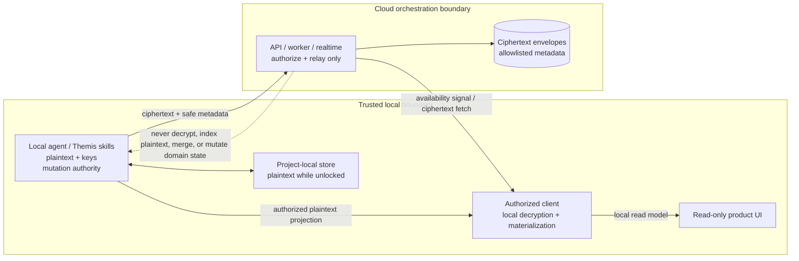

# Project-scoped synchronization trust boundary

These Mermaid diagrams are the renderable trust/authority artifact for PZS-001.
They describe authority and custody; they do not claim that deferred runtime
implementation or end-to-end delivery is complete.

## Plaintext and mutation authority

## Authority rules

- Local agents and skills retain plaintext and domain mutation authority.
- Cloud services may authenticate, authorize, persist ciphertext, assign
  non-sensitive cursor/revision metadata, and signal availability only.
- Cloud services do not receive project decryption keys and do not become the
  project authority.
- Clients decrypt and materialize locally after their local authorization
  decision; the cloud response is not proof of plaintext access.
